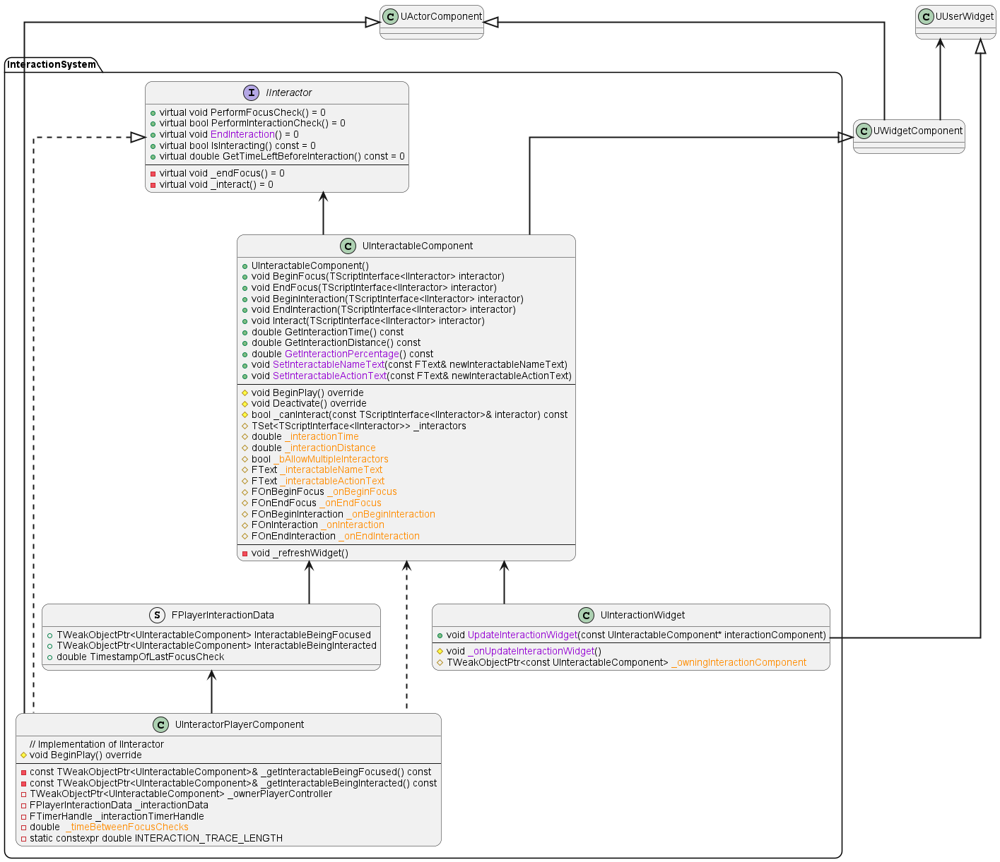

# Interaction System
The purpose of the Interaction System is to allow interactions between different actors. Examples of interactions are:
- Turning a light on/off
- Looting a body or a chest
- Opening a door
- Talking to an NPC
- Cutting down a tree
- ...

The system is based on two elements: the `UInteractableComponent` and the `IInteractor` interface.
- Any actor owning a `UInteractableComponent` can be interacted with by `IInteractor`s
- Any concrete `IInteractor` can interact with any actor owning a `UInteractionComponent` when certain conditions are met.

We'll now examine these two elements in detail. But first, have a look at the system's UMLs:

## UInteractableComponent
An `UInteractableComponent` is a `UWidgetComponent` whose job is to make any actor owning it interactable by `IInteractor` 
actors.  In practical terms, the `UInteractableComponent`'s main responsibility is to broadcast to its owning actor, a.k.a.
the Interactable, whenever an `IInteractor` is doing "something interesting".  
What's "interesting" is described by the `UInteractableComponent`'s 5 core public functions, which are called directly by the
`IInteractor` when certain conditions are met and notify the Interactable by using some delegates. Here is a description of
their purpose:
1. `BeginFocus()`: the `IInteractor` communicates that it is aware the Interactable exists but is not interacting with it yet.
The `UInteractableComponent` communicates to its owner:
"Hey owner, this `IInteractor` is aware of us. Are you going to do something about it?". At this point, the Interactable may 
or may not have some `BeginFocus()`-specific logic that gets executed. Regardless of whether the `BeginFocus()`-specific
logic exists or not, the `UInteractableComponent` has another job at `BeginFocus()`: to show the widget that
tells the `IInteractor` how to interact, and what the Interactable is going to do when `Interact()` gets called. This is the 
reason why `UInteractableComponent` is a `UWidgetComponent`. The widget class is `UInteractionWidget`, a custom widget capable
of retrieving the information to show from the `UInteractableComponent`.
2. `EndFocus()`: the  opposite of `BeginFocus()`, gets called by the `IInteractor` to communicate to the Interactable that
it is not being observed anymore. The `EndFocus()`-specific logic gets executed if the Interactable has it but, regardless, 
the interaction widget is made invisible: the `IInteractor` shouldn't be shown interaction-related data when it's not
observing the Interactable.
3. `BeginInteraction()`: the `IInteractor` has started the actual interaction with the Interactable. However, this doesn't mean
that the interaction has occurred yet! This function exists because some interactions require time to occur, meaning that 
`BeginInteraction()` and `Interact()` (see below) aren't called on the same tick. The `BeginInteraction()`-specific logic gets
executed if the Interactable has it, but it's not mandatory. 
4. `Interact()`: it's finally time: the `IInteractor` is interacting with the Interactable! Differently from the functions
presented above, the `Interact()`-specific logic is essentially mandatory for the Interactable (what's the point of being 
interactable if you don't do anything when the actual interaction occurs?)
5. `EndInteraction()`: the opposite of `BeginInteraction()`, the `IInteractor` (or the Interactable itself in this case,
`EndInteraction()` is special, see next paragraphs) uses it to tell the Interactable that the interaction is over and that
`EndInteraction()`-specific logic can be executed if present.

### An Example
Let's suppose that the `IInteractor` is the player controller and that the Interactable is some NPC. The player wants to
talk to the NPC.
1. The player first looks at the NPC and calls `BeginFocus()` on its `UInteractableComponent`. The NPC actor gets notified by
the component and has some logic that plays an animation: it smiles at the player and waves its right hand. This is a nice
little detail that makes the game more immersive, but the NPC could have worked perfectly without it. What's very important
though, is that  the `UInteractableComponent` makes the `UInteractionWidget` pop. The widget says "Town Merchant, press E to
talk". However, the dialog between the two characters doesn't start until the player interacts with the NPC by pressing the
E key.
2. The player might decide that talking to the NPC is not that important right now, look away, and call `EndFocus()` on the focused
`UInteractableComponent`. The widget immediately disappears from the viewport, the NPC is notified and transitions to its idle
animation. However, in case the player presses the E key...
3. `BeginInteraction()` gets called! `UInteractableComponent` broadcast to its owner. Let's suppose that our merchant is 
behind a window and has to open it before talking to the player: the logic that plays the NPC's animation for opening the
window gets executed. The interaction hasn't started yet, the player is still waiting. Once the animation has finished
playing or in case there wasn't one, we finally get to call...
4. `Interact()`! The NPC can finally execute the logic that causes the dialog system to come into play. Some widget with
dialog options and items to buy will appear. The player is officially talking to our merchant. This logic isn't optional like
the one linked to `BeginFocus()`, `EndFocus()`, or `BeginInteraction()`. The logic that gets executed at `Interact()` is the
core of the interaction and, without it, there wouldn't be any meaning in interacting with the NPC.
5. After getting some potions and news on what's going on around the block, the player decides it is time to say goodbye to
our NPC and keep going on his journey by pressing the X button on the top left corner of the dialog system's widget. That
makes him (or the Interactable itself, see next paragraphs) call `UInteractableComponent::EndInteraction()`, which tells to
the Interactable merchant to execute the logic that closes the shop widget and makes the character yell "Thanks, come back
soon!" to the player. This doesn't necessarily mean that `EndFocus()` gets called though: the player might still be looking
at the NPC and, in that case, the `UInteractionWidget` must still visible on the merchant's head. Only once the player turns
his head `EndFocus()` is invoked: the interaction widget disappears, and the NPC is told so and transitions to its idle
animation.