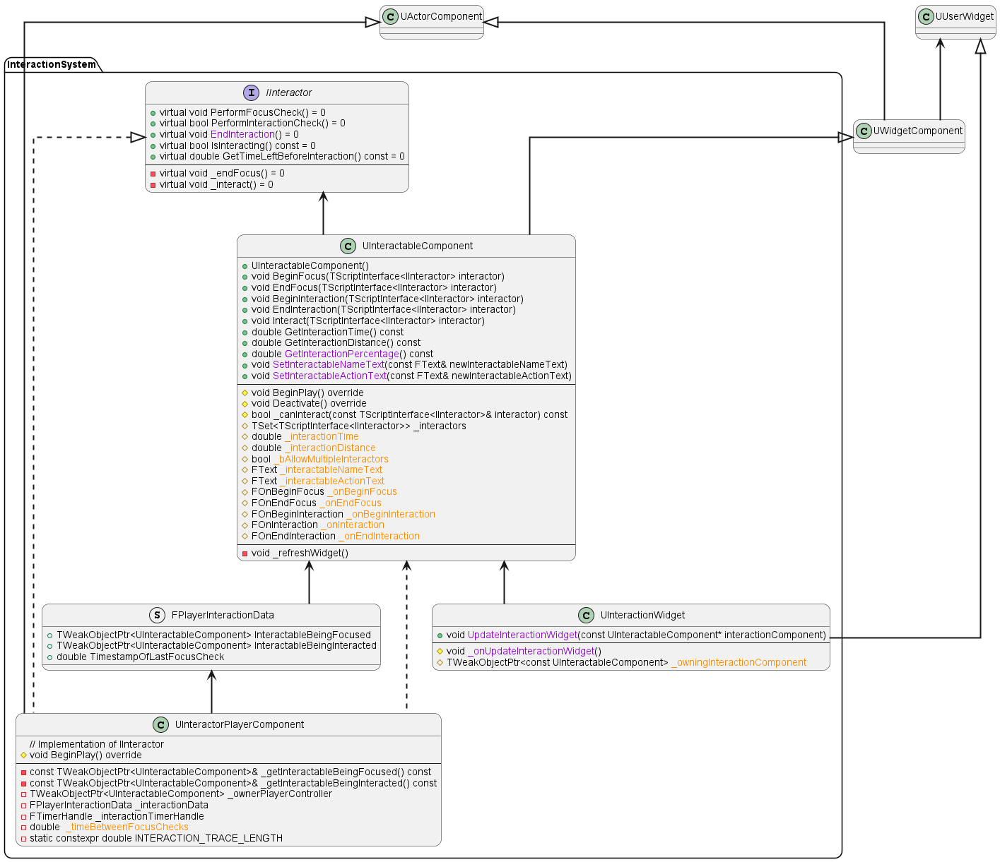
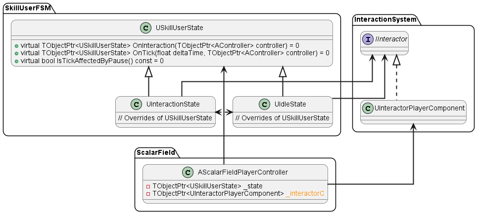

# Interaction System
The purpose of the Interaction System is to allow interactions between different actors. Examples of interactions are:
- Turning a light on/off
- Looting a body or a chest
- Opening a door
- Talking to an NPC
- Cutting down a tree
- ...

The system is based on two elements: the `UInteractableComponent` and the `IInteractor` interface.
- Any actor owning a `UInteractableComponent` can be interacted with by `IInteractor`s
- Any concrete `IInteractor` can interact with any actor owning a `UInteractionComponent` when certain conditions are met.

We'll now examine these two elements in detail. But first, have a look at the system's UMLs:

## UInteractableComponent
An `UInteractableComponent` is a `UWidgetComponent` whose job is to make any actor owning it interactable by `IInteractor` 
actors.  In practical terms, the `UInteractableComponent`'s main responsibility is to broadcast to its owning actor, a.k.a.
the Interactable, whenever an `IInteractor` is doing "something interesting".  
What's "interesting" is described by the `UInteractableComponent`'s 5 core public functions, which are called directly by the
`IInteractor` when certain conditions are met and notify the Interactable by using some delegates. Here is a description of
their purpose:
1. `BeginFocus()`: the `IInteractor` communicates that it is aware the Interactable exists but is not interacting with it yet.
The `UInteractableComponent` communicates to its owner:
"Hey owner, this `IInteractor` is aware of us. Are you going to do something about it?". At this point, the Interactable may 
or may not have some `BeginFocus()`-specific logic that gets executed. Regardless of whether the `BeginFocus()`-specific
logic exists or not, the `UInteractableComponent` has another job at `BeginFocus()`: to show the widget that
tells the `IInteractor` how to interact, and what the Interactable is going to do when `Interact()` gets called. This is the 
reason why `UInteractableComponent` is a `UWidgetComponent`. The widget class is `UInteractionWidget`, a custom widget capable
of retrieving the information to show from the `UInteractableComponent`.
2. `EndFocus()`: the  opposite of `BeginFocus()`, gets called by the `IInteractor` to communicate to the Interactable that
it is not being observed anymore. The `EndFocus()`-specific logic gets executed if the Interactable has it but, regardless, 
the interaction widget is made invisible: the `IInteractor` shouldn't be shown interaction-related data when it's not
observing the Interactable.
3. `BeginInteraction()`: the `IInteractor` has started the actual interaction with the Interactable. However, this doesn't mean
that the interaction has occurred yet! This function exists because some interactions require time to occur, meaning that 
`BeginInteraction()` and `Interact()` (see below) aren't called on the same tick. The `BeginInteraction()`-specific logic gets
executed if the Interactable has it, but it's not mandatory. 
4. `Interact()`: it's finally time: the `IInteractor` is interacting with the Interactable! Differently from the functions
presented above, the `Interact()`-specific logic is essentially mandatory for the Interactable (what's the point of being 
interactable if you don't do anything when the actual interaction occurs?)
5. `EndInteraction()`: the opposite of `BeginInteraction()`, the `IInteractor` (or the Interactable itself in this case,
`EndInteraction()` is special, see next paragraphs) uses it to tell the Interactable that the interaction is over and that
`EndInteraction()`-specific logic can be executed if present.

### An Example
Let's suppose that the `IInteractor` is the player controller and that the Interactable is some NPC. The player wants to
talk to the NPC.
1. The player first looks at the NPC and calls `BeginFocus()` on its `UInteractableComponent`. The NPC actor gets notified by
the component and has some logic that plays an animation: it smiles at the player and waves its right hand. This is a nice
little detail that makes the game more immersive, but the NPC could have worked perfectly without it. What's very important
though, is that  the `UInteractableComponent` makes the `UInteractionWidget` pop. The widget says "Town Merchant, press E to
talk". However, the dialog between the two characters doesn't start until the player interacts with the NPC by pressing the
E key.
2. The player might decide that talking to the NPC is not that important right now, look away, and call `EndFocus()` on the focused
`UInteractableComponent`. The widget immediately disappears from the viewport, the NPC is notified and transitions to its idle
animation. However, in case the player presses the E key...
3. `BeginInteraction()` gets called! `UInteractableComponent` broadcast to its owner. Let's suppose that our merchant is 
behind a window and has to open it before talking to the player: the logic that plays the NPC's animation for opening the
window gets executed. The interaction hasn't started yet, the player is still waiting. Once the animation has finished
playing or in case there wasn't one, we finally get to call...
4. `Interact()`! The NPC can finally execute the logic that causes the dialog system to come into play. Some widget with
dialog options and items to buy will appear. The player is officially talking to our merchant. This logic isn't optional like
the one linked to `BeginFocus()`, `EndFocus()`, or `BeginInteraction()`. The logic that gets executed at `Interact()` is the
core of the interaction and, without it, there wouldn't be any meaning in interacting with the NPC.
5. After getting some potions and news on what's going on around the block, the player decides it is time to say goodbye to
our NPC and keep going on his journey by pressing the X button on the top left corner of the dialog system's widget. That
makes him (or the Interactable itself, see next paragraphs) call `UInteractableComponent::EndInteraction()`, which tells to
the Interactable merchant to execute the logic that closes the shop widget and makes the character yell "Thanks, come back
soon!" to the player. This doesn't necessarily mean that `EndFocus()` gets called though: the player might still be looking
at the NPC and, in that case, the `UInteractionWidget` must still visible on the merchant's head. Only once the player turns
his head `EndFocus()` is invoked: the interaction widget disappears, and the NPC is told so and transitions to its idle
animation.

## IInteractor
Only objects implementing the `IInteractor` interface are allowed to deal with Interactables, i.e. actors owning a
`UInteractableComponent.` "Dealing" with Interactables means that `IInteractor`s can focus and interact with them:
- **Focusing** an Interactable means that the `IInteractor` is aware that the Interactable exist and, at the very least,
ready to interact with it. 
- **Interacting** with an Interactable means that the `IInteractor` has, at the very least, communicated to the Interactable
that it intends to interact with it (`UInteractableComponent::BeginInteraction()` has been fired). This, of course, does not
imply that `UInteractableComponent::Interact()` has been called. However, while interacting, we're sure that the `IInteractor`
is committed to the interaction process.
- Focus is generally required to start an interaction, and is usually no longer necessary once the interaction has begun.
For example, you probably don't need focus to end an interaction.  However, the relation between focus and interaction is up to the
`IInteractor`-specific implementation.

Let's get an high level picture of `IInteractor`'s main functions:
- `PerformFocusCheck()` gets executed when it's time for the `IInteractor` to check if it is currently focusing some
Interactable. The nature of the checks depends on the specific `IInteractor` implementation (for example, a player controller
could check if there is an Interactable under the mouse cursor, an AI controller if there is one within a certain range that
matches some criteria). In any case, if the check is successful and an Interactable is found, 
`UInteractableComponent::BeginFocus()` is called. We can now say that the `IInteractor` is focusing.
- `_endFocus()` gets called when the `IInteractor` determines that it is time to forget the Interactable being focused.
Before that though, `UInteractableComponent::EndFocus()` gets executed.
- `PerformInteractionCheck()` gets invoked when the `IInteractor` needs to check if it can interact with some Interactable.
Again, the nature of the checks varies depending on the `IInteractor` (Is it focusing something? Has a key been pressed? Is
it already interacting with that Interactable?). If the checks succeed, this function must call
`UInteractableComponent::BeginInteraction()` and, depending on the Interactable's interaction time, call or schedule a call
to `IInteractor::_interact()`.
- `_interact()` job is basically to call `UInteractableComponent::Interact()`, but it might perform some additional cleanup
work depending on the specific `IInteractor`.
- `EndInteraction()` terminates the current interaction, if any is occurring, by calling
`UInteractableComponent::EndInteraction()`. This function could be called by the `IInteractor` itself, or by its owner if it
is a component. An example of this could be when we start interacting with Interactable B while waiting for interaction
with Interactable A. However, differently from the functions above, it is quite common for `EndInteract()` to be called by
Interactables. Take an Interactable lamp for example: when the lamp turns on, it tells the `IInteractor` that flipped its
switch "Ok, I've been turned on, our interaction is now over".

Let's now take a look at a concrete `IInteractor`, the

### UInteractorPlayerComponent
This `IInteractor` is a `UActorComponent` owned by the `AScalarFieldPlayerController` that allows the player to
interact using the mouse cursor. Here is how this component relates to the other modules of ScalarField:

- When in Idle or Interaction state, every few ticks, the controller tells its `UInteractorPlayerComponent` that it's time to
`PerformFocusCheck()`. The function's override casts a line trace from the mouse cursor and:
    - If an actor with an `UInteractableComponent` that's not the one we're already focusing is hit and the controller's
    Pawn is sufficiently close to it, we store the component within the `IInteractor` and call `BeginFocus()` on it.
    - If the condition above isn't met, we forget whatever we're currently focusing by calling `_endFocus()`.
- When in Idle or Interaction state the E key is pressed, the controller tells its `UInteractorPlayerComponent` that it's
time to `PerformInteractionCheck()`:
    - We first check the cached focused component. If we're already interacting with it or the cache is empty, nothing 
    happens and we immediately quit the interaction check.
    - Otherwise, we first call `UInteractorPlayerComponent::EndInteraction()` to stop any interaction that is currently in
    progress. We want the player to interact with one Interactable at a time.
    - Finally, we set the interactable being focused as being interacted, call `UInteractableComponent::BeginInteraction()`,
    and (schedule a) call to `_interact()`
- The player controller changes state depending on the result of the interaction check:
    - If the interaction check was positive, it goes to Interaction state
    - If the interaction check was negative, it goes to Idle state
- `EndInteraction()` is also called if the player aborts the interaction by pressing Q or if the Interactable establishes
that the interaction is over. In such cases, we go Idle on the following tick.

Let's resume the relation between Focus and Interaction for this `IInteractor`:
- Focus is required to start the Interaction.
- Focus is not required to perform the Interaction, i.e. for `UInteractorPlayerComponent::_interact()` and
`UInteractableComponent::Interact()` to be called.
- Focus is not required to call `UInteractorPlayerComponent::EndInteraction()`.
- The player can Focus and Interactable different from the one being interacted without the interaction being aborted.

These choices have been made considering that ScalarField is a RPG with Tactical Pause. For different kinds of gameplay,
different choices might be better. For example, in a FPS, requiring focus while waiting for the `_interact()` call might
not be a bad idea.