# Thermodynamics

In ScalarField, there is a concept of Thermodynamics: `AActor`s have a temperature, which can rise/fall depending on the surrounding environment and the way heat flows in it.  
In this document, I'll explain the algorithm that simulates heat exchanges and describe how it evolves over time.

## Version 1.0 - A First Draft
First of all, I created a collision object channel called `Thermodynamics` and a collision profile called `Heat Exchanger`. `Heat Exchanger`s are objects of type `Thermodynamics` that ignore every trace and object channel except for other `Thermodynamics` objects, with whom they overlap.

I made a `UCapsuleComponent` called `UThermodynamicComponent`, with the following characteristics:
1. Any `AActor` holding it has as a concept of temperature, a `double` value stored within the component itself.
2. The capsule has the `Heat Exchanger` collision profile, so that it can detect overlaps with other `UThermodynamicComponent`s.

The idea behind the algorithm is roughly the following: every `Tick()`, each `UThermodynamicComponent` in the world searches for other `UThermodynamicComponent`s overlapping it. Then, it updates its internal temperature value using the overlapping components' temperature. Now, you probably have three questions:
1. **How do you determine how much the temperature has to vary exactly?**
  - Time ago I made a pdf you can find in this very folder. It shows both the formula I use and how it has been derived. Briefly, the formula expresses the variation in temperature for a body that exchanges heat with another through conduction _over a very small amount of time `dt`_. The fact that `dt` has to be small is why the formula must be applied tick after tick for each actor exchanging heat.
2. **Why are you using capsules? How does this even emulate thermodynamics in the real world?**
  - This is also explained in the pdf I was mentioning above. Basically, the idea is that each `AActor` has a thermodynamic capsule that barely goes beyond its physical extension (i.e. its visible mesh). This way, two actors exchange heat when they are in contact, simulating real world's heat transmission by conduction (like when you touch a radiator and it warms you). To simulate heat exchange with a distance source, I simulate air by placing a lattice of "air molecule" `AActor`s and having each of them thermodynamically collide with its neighbors. This way the hottest body increases the temperature of its surrounding air molecules, and they in turn increase the temperature of their neighbors, and so on and so on until the coldest body is surrounded by hot particles that start increasing its temperature (like when you are in a room with a radiator and, after a while, you start heating up because it heated up the air first). Processes of heat transmission by convection and radiation are ignored.
3. **In the real world the temperature varies simultaneously for every body exchanging heat. How do you achieve this** with a CPU that is, by definition, sequential? In other words: can you explain this algorithm?
  - Keep reading :)

The most simple flow that comes to mind by reading the rough description I gave above is the following:

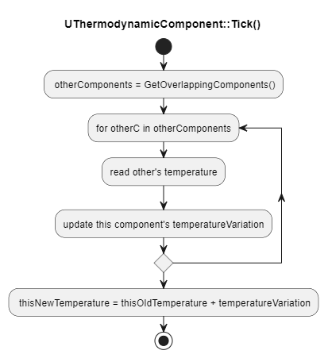

This flow hides a subtle problem. In the real world, the temperature varies simultaneously for every body exchanging heat. However, CPUs are sequential beasts, and `Tick()`s of `AActor`s are performed one at a time on the game thread.

Suppose you have the three following `UThermodynamicComponent`s, where `T(X)` is the temperature of component `X` and `t(X)` is the time at which the `Tick()` of component `X` is performed by the engine.

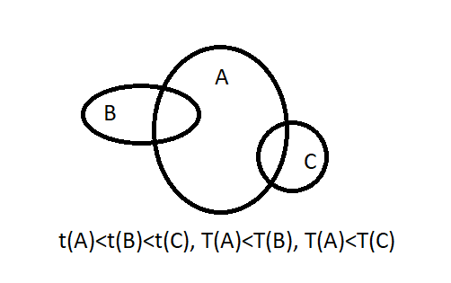

By executing the flow diagram shown above, `A` increases reaches a new temperature `T'(A) > T(A)` by interacting with `B` and `C`. Next, when `B` is going to interact with `A`, it is going to see temperature `T'(A)` for component `A` instead of `T(A)`, breaking simultaneity.

Immediately updating the temperatures of the components the current one is interacting with, like the following diagram suggests, is not gonna help either:

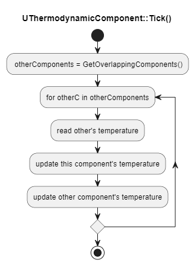

If you're not convinced, consider the following scenario:

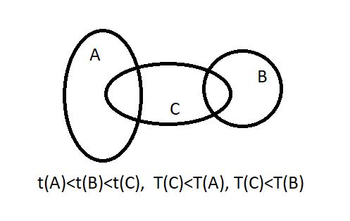

`A` interacts with `C`, immediately causing C's temperature to rise to `T'(C) > T(C)`. Now, when `B` interacts with `C`, it will do so by seeing `C` with an higher temperature than the real one this frame. Moreover, we could potentially have `T'(C) > T(B)`, causing not only a computational error, but an inversion of the heat flow between components `B` and `C`!!

### [Version 2.0 - Simultaneity](https://github.com/PedrelliLuca/ScalarField/issues/4)
The simultaneity problems described above can be fixed by taking the following actions:
- Each component stores two temperature values: the temperature for the current frame `Tcurr` and the one for the next frame `Tnext`
- Each component immediately interacts with all other overlapping components regardless of whether they're hotter or colder than it. For a given component, the formula uses the component and neighbors' `Tcurr`s and produces a new value for this component's `Tnext`.
- During its tick, the component only updates its own `Tnext`, not the ones of the neighbor components.

Of course, this only works as long as, before the beginning of the next frame, the `Tcurr` value of every component has been substituted with the newly-computed `Tnext`. This brings a new question: when to we execute the assignment `Tcurr = Tnext`?

Let's say component `A` is interacting with components `X1`, ..., `Xn`. `A` knows that, this frame, the `Xs` are `n` thanks to `GetOverlappingComponents()`. If we make every `Xi` increase a counter internal to `A` during the `Xi`'s tick time, `A` is able to tell how many of the `Xi`s interacted with it during the given frame. When the counter reaches `n`, we can set `A`'s `Tcurr` equal to `Tnext`.  
However, there is an additional trick: `n` must be set to infinite until `A`'s tick. This way if the `X1`, ..., `Xn` all tick before `A`, the nth `Xi` won't trigger `A`'s assignment `Tcurr = Tnext` (that would cause a bug since `Tnext` is computed during `A`'s tick).

This process I just described can be summarized by the following diagram:

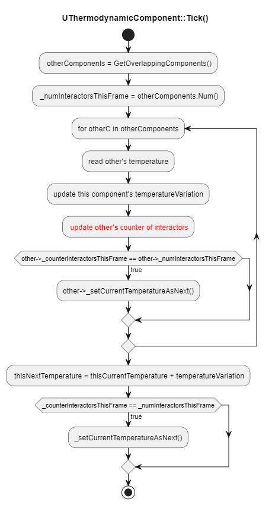  
_Note how a thermodynamic component's counter gets updated exclusively during some other thermodynamic component's tick. In other words: a given thermodynamic component never updates its own counter._

, where:

  
_Note how, by setting the number of interactors to infinity, we force any given thermodynamic component to tick and compute its next temperature before updating the current one._

## [Version 3.0 - Better collision](https://github.com/PedrelliLuca/ScalarField/issues/29)
The algorithm described above works fine, but having the `UThermodynamicComponent` inherit from `UCapsuleComponent` forces a capsule-shaped thermodynamic collision that can be very inaccurate for actor with complex shapes or simple shapes that do not resemble a capsule at all. For example, imagine wrapping a tall cone within a capsule: most of the space within the capsule would be empty!

Fortunately, this can be easily fixed by:
1. Making `UThermodynamicComponent` inherit from `UActorComponent` instead.
2. Making `UThermodynamicComponent` hold a reference to a generic `HeatExchanger` `UPrimitiveComponent` within the same owner `AActor`. This primitive component can be any collision: from some basic collision component (`UBoxComponent`, `UCapsuleComponent`), to a `UStaticMeshComponent`, or even a `USkeletalMeshComponent`!

The referenced `UPrimitiveComponent`, that we'll refer to as "thermal collision", has its `OnBeginOverlap` and `OnEndOverlap` events bound to a pair of new `UThermodynamicComponent` functions. These functions update a new internal `TSet`, called `_heatExchangers`, whose job is to keep track of the other `UThermodynamicComponent`s the current one is overlapping with. Thanks to `_heatExchangers` we don't have to call `GetOverlappingComponents()` each frame, which is a quite expansive function. By all means, `_heatExchangers` acts like a local cache of thermodynamically-relevant components.

## [Version 4.0 - Collision Checks' Performance](https://github.com/PedrelliLuca/ScalarField/issues/31)
Thanks to the changes described in version 3.0 we can use very detailed shapes for the thermal collisions of our `AActor`s. Detailed, complex collisions are great: by using them, we get an accurate simulation of Thermodynamics and, therefore, an accurate gameplay based on it.

However, this comes at a price: complex collisions are made of many polygons, which are made by many triangles and vertices. The more triangles you have, the more expensive your collision checks will become. Now, for a handful of `AActor`s the drop in FPS is barely noticeable. But, in a situation where there are hundreds or even thousands of `AActor`s in the scene, the fluidity of the game would be seriously affected. Unfortunately, this latter is our case: as described in version 1.0, to simulate air we have to spawn a lot of "air molecule" `AActor`s, each with its own `UThermodynamicComponent` and `UPrimitiveComponent` acting as thermal collision.

To achieve accuracy while also saving performance, what we want is to have 2 thermal collisions for each `UThermodynamicComponent`:
- A "simple" one, with a very basic shape that coarsely wraps the mesh of the owner `AActor`.
- A "complex", smaller one, that accurately follows the `AActor`'s shape and is, therefore, made of many more polygons than the "simple" collision.

The new algorithm works like this:

- The simple thermal collision is always active, and its overlap events are bound to keep track of other simple collisions overlapping with it. This collision is made of very few polygons, so the fact that it is always listening for overlaps is not computationally expensive.  
- The complex thermal collision sleeps by default (no tick, `NoCollision` profile setting) and gets awakened (tick, `HeatExchanger` profile setting) as soon as a overlap is detected by the simple thermal collision. If the simple collision stops colliding with everything, it will get back to sleep.
- The complex thermal collision is then checked at each tick for every `UThermodynamicComponent` whose simple collision is colliding with the current one. The heat exchange can occur if and only if the complex collision is colliding with the other component's complex collision.

The simple collision usually won't overlap, meaning that we'll have the complex collision turned off most of the time. This saves performance. Still, when two simple collisions overlap, meaning their owner `AActor`s are quite close, the complex collisions come into play for a short time to determine whether the heat exchange should really occur or not. This ensures accuracy when it matters.

The currently overlapping simple collisions are stored in the internal `TSet` called `_possibleHeatExchangers`, that is just a rename of the `_heatExchangers` set mentioned in version 3.0. The rename is necessary, since a simple collision overlap now won't guarantee a heat exchange with the other `UThermodynamicComponent` at tick time.

Here is a pair of diagrams explaining what happens when the simple collision overlap events trigger:

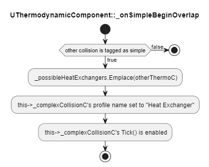  

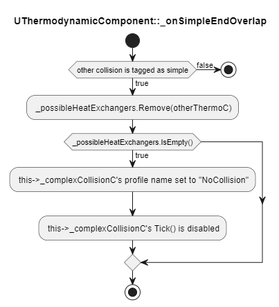  

Below is what happens at Tick, where the variables `_numInteractorsThisFrame` and `_counterInteractorsThisFrame` of version 2.0 have been renamed to `_timesToBeCheckedThisFrame` and `_counterOfChecksThisFrame` to better fit the latest changes. Note that, since the simple collision cannot discriminate between true and fake heat exchangers, `_counterOfChecksThisFrame` must be updated regardless of whether the heat exchange happened or not (which is why I decided to rename it).

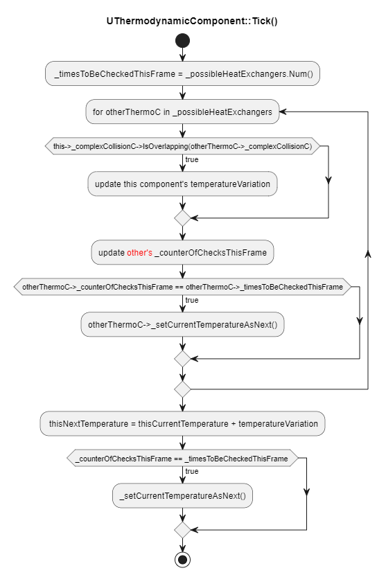

One last question remains open: what if we don't want a complex collision? What if we have very simple `AActor`s for which having just a simple collision would be perfectly fine? This is exactly the case of our "air molecules", they just need a simple spherical collision. To account for actors like this, we simply need to slightly edit the flow diagram above to be using "the most complex collision" of `this` and `otherThermoC` instead of the `_complexCollisionC`.

## [Version 5.0 - The 1 Frame Off Problem](https://github.com/PedrelliLuca/ScalarField/pull/81)

The system above works fine until no new `UThermodynamicComponent` spawns in the scene. As soon an `AActor` with this component spawns, things will get pretty weird. This is because **spawning an actor means that the actor and all of its components will be ticked in the group it spawned, regardless of the tick group**. The very next frame, the newly spawned actor will be ticked in the correct tick group.

The first problem of this kind that I noticed was the following: when a Character A cast [Cone of Cold](https://www.youtube.com/watch?v=M9UciOo9rT8&ab_channel=LucaPedrelli), if the spawned cone immediately overlapped a second Character B, this latter's `UThermodynamicComponent` stopped updating its temperature. Since the cone itself is an `AActor` with thermodynamics, the following could happen:
- Character B ticks, B has already interacted with every overlapping thermodynamic component => Reset: `_counterOfChecksThisFrame = 0` and `_timesToBeCheckedThisFrame = +inf`
- Later on the same frame the Cone of Cold spawns, overlapped to Character B. It ticks, interacting with B => B's counter is increased
- A new frame begins. 
- Let's assume the cone ticks before Character B. This can happen since both Thermodynamic Components belong to the same Tick group. The result would be that B's counter would be increased again before its `_counterOfChecksThisFrame == _timesToBeCheckedThisFrame` check.
- `_timesToBeCheckedThisFrame` is computed at B's tick and it's based on the size of `_possibleHeatExchangers`, which is a `TSet` (unique elements) => the cone is accounted only once by the counter cap, even though it incresed the true counter 2 times
- We end up overshooting `_timesToBeCheckedThisFrame` and, in turn, never calling `_setCurrentTemperatureAsNext()` => Character B's temperature won't be updated anymore.

 [This commit](https://github.com/PedrelliLuca/ScalarField/pull/79/commits/567387f2443e978e92815a316034568e2fda1426) shows a first tentative fix, i.e. making every `UThermodynamicComponent` do nothing on its 1st frame thanks to a boolean:
 
 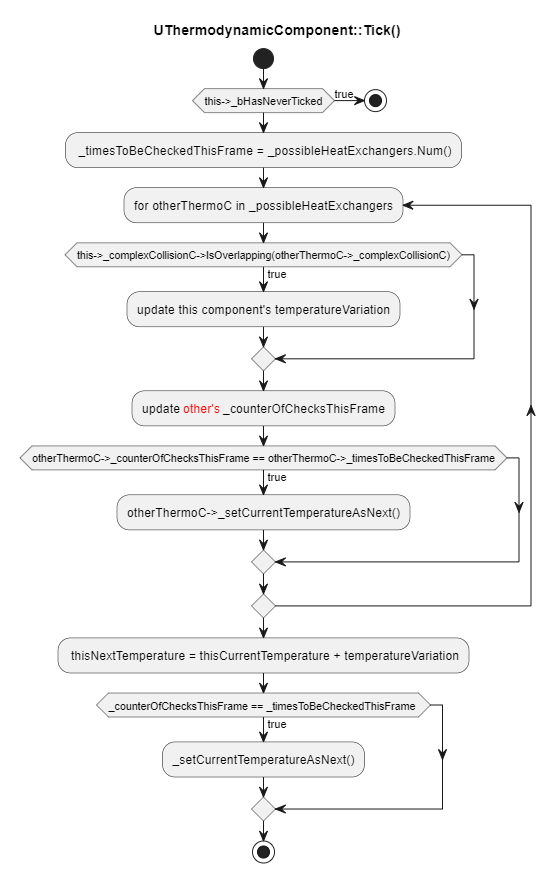
 
 This solved the Cone Of Cold bug I just described, but it's only a part of the whole 1 Frame Off bug.

 Suppose that Character A casts the Ice Shard or Fire Globe skill on a moving target, Character B. We already applied the fix described above hence, during its first frame, the shard (which is a thermodynamic actor) doesn't tick. However, if it's not the last ticking actor of the tick, the shard's `_counterOfChecksThisFrame` will be updated by any other component ticking after it! And if any one of these components tick before the shard on the next frame, they will be still accounted twice!

 The second part of the fix is, therefore, to have each thermodynamic component stop ticking with every other component that hasn't ticked at least once. Here is the diagram:

  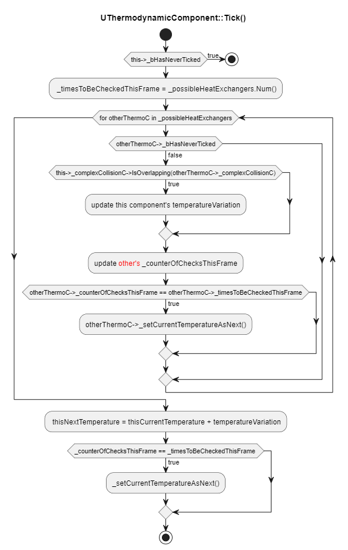

  Is this all? Nope. We still have a problem. On the frame it spawns, the shard will still interact with any overlapped components that ticks after it. It's not all of them though, and there's a very high chance that one of these components will tick before it on the following frame.

  Components, by default, tick in the `TG_DuringPhysics` group, and the thermodynamic component is no exception. To solve this 3rd bug, the fix is to force thermodynamic components to tick in `TG_PostUpdateWork` on their first frame, so that there cannot be other thermodynamic components interacting with them and they can reach their 2nd frame of life with the counter still at zero.

  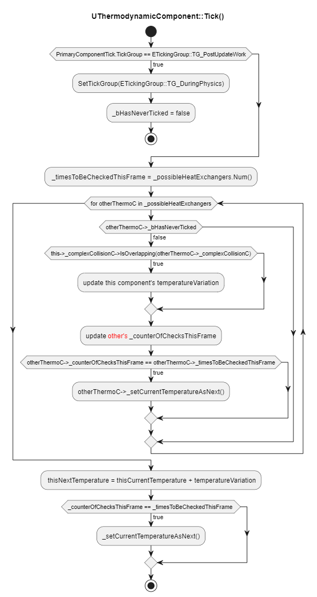

  One last problematic scenario is left. Suppose that an actor component moving really fast is interacted by 6 components. Then, when their turn comes, since the tick is `TG_DuringPhysics` and they're moving fast, we're not guaranteed that all 6 of the actors that updated the counter are still interacting, `_possibleHeatExchangers` could be smaller. In this case, we'd still overshoot. This will be fixed in the future by not making thermodynamics tick every frame.
