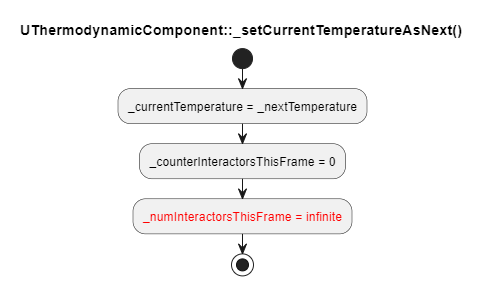

# Thermodynamics

In ScalarField, there is the concept of Thermodynamics: `AActor`s have a temperature, which can rise/fall depending on the surrounding environment and the way heat flows in it.  
In this document, I'll explain the algorithm that simulates heat exchanges and describe how it evolves over time.

## The Algorithm
First of all, I created a collision object channel called `Thermodynamics` and a collision profile called `Heat Exchanger`. `Heat Exchanger`s are objects of type `Thermodynamics` that ignore every trace and object channel except for other `Thermodynamics` objects, with whom they overlap.

I made a `UCapsuleComponent` called `UThermodynamicComponent`, with the following characteristics:
1. Any `AActor` holding it has as a concept of temperature, a `double` value stored within the component itself.
2. The capsule has the `Heat Exchanger` collision profile, so that it can detect overlaps with other `UThermodynamicComponent`s.

The idea behind the algorithm is roughly the following: every `Tick()`, each `UThermodynamicComponent` in the world searches for other `UThermodynamicComponent`s overlapping it. Then, it updates its internal temperature value using the overlapping components' temperature. Now, you probably have three questions:
1. **How do you determine how much the temperature has to vary exactly?**
  - Time ago I made a pdf you can find in this very folder. It shows both the formula I use and how it has been derived. Briefly, the formula expresses the variation in temperature for a body that exchanges heat with another through conduction over a very small amount of time `dt`.
2. **Why are you using capsules? How does this even emulate thermodynamics in the real world?**
  - This is also explained in the pdf I was mentioning above. Basically, the idea is that each `AActor` has a thermodynamic capsule that barely goes beyond its physical extension (i.e. its visible mesh). This way, two actors exchange heat when they are in contact, simulating real world's heat transmission by conduction (like when you touch a radiator and it warms you). To simulate heat exchange with a distance source, I simulate air by placing a lattice of "air molecule" `AActor`s and having each of them thermodynamically collide with its neighbors. This way the hottest body increases the temperature of its surrounding air molecules, and they in turn increase the temperature of their neighbors, and so on and so on until the coldest body is now surronded by hot particle that start increasing its temperature (like when you are in a room with a radiator and, after a while, you start heating up). Heat transmission by convection and radiation are ignored.
3. **In the real world the temperature varies simultaneously for every body exchanging heat. How do you achieve this** with a CPU that is, by definition, sequential? In other words: can you explain this algorithm?
  - Keep reading, because that's what I am going to explain in the next sections!

### Version 1.0
The most simple flow that comes to mind by reading the rough description I gave above is the following:

This flow hides a subtle problem. In the real world, the temperature varies simultaneously for every body exchanging heat. However, CPUs are sequential beasts, and `Tick()`s of `AActor`s are performed one at a time on the game thread.

Suppose you have the three following `UThermodynamicComponent`s, where `T(X)` is the temperature of component `X` and `t(X)` is the time at which the `Tick()` of component `X` is performed by the engine.

By executing the flow diagram shown above, `A` increases reaches a new temperature `T'(A) > T(A)` by interacting with `B` and `C`. Next, when `B` is going to interact with `A`, it is going to see temperature `T'(A)` for component `A` instead of `T(A)`, breaking simultaneity.

Immediately updating the temperatures of the components the current one is interacting with, like the following diagram suggests, is not gonna help either:

If you're not convinced, consider the following scenario:

`A` interacts with `C`, immediately causing C's temperature to rise to `T'(C) > T(C)`. Now, when `B` interacts with `C`, it will do so by seeing `C` with an higher temperature than the real one this frame. Moreover, we could potentially have `T'(C) > T(B)`, causing not only a computational error, but an inversion of the heat flow between components `B` and `C`.

### Version 2.0
The simultaneity problems above can be fixed by taking the following actions:
- Each component stores two temperature values: the temperature for the current frame `Tcurr` and the one for the next frame `Tnext`
- Each component immediately interacts with all other interacting components regardless of whether they're hotter or colder than it. For a given component, the formula uses the component and neighbors' `Tcurr`s and produces a new value for this component's `Tnext`.
- During its tick, the component only updates its own `Tnext`, not the ones of the neighbor components.

Of course, this only works as long as, before the beginning of the next frame, the `Tcurr` value of every component has been substituted with the newly-computed `Tnext`. This brings a new question: when to we execute the assignment `Tcurr = Tnext`?

Let's say component `A` is interacting with components `X1`, ..., `Xn`. `A` knows that the `Xs` are `n` thanks to `GetOverlappingComponents()`. If we make every `Xi` increase a counter internal to `A` during the `Xi`'s tick time, we can keep track of how many of them already interacted with `A`: when the counter reaches `n`, we can set `A`'s `Tcurr` equal to `Tnext`. However, there is an additional trick: `n` is temporarily set to infinite until `A`'s tick. so that if the `X1`, ..., `Xn` all tick before `A`, it's not the `Xn` that would trigger `A`'s assignment `Tcurr = Tnext` (that would cause a bug since `Tnext` is computed during `A`'s tick).

The process described above can be summarized by the following diagram:

  
_Note how a thermodynamic component's counter gets updated exclusively during some other thermodynamic component's tick. In other words: a given thermodynamic component never updates its own counter by itself._

, where:

  
_Note how, by setting the number of interactors to infinity, we force any given thermodynamic component to tick and compute its next temperature before updating the current one._
