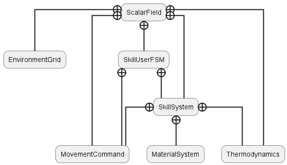

# ScalarField
A "Dragon Age: Origins" - like game, where magic works by interacting with the environment. You can find a playlist of videos showing my progress over time on [my YouTube channel](https://www.youtube.com/playlist?list=PLerNkl_bon8TyPWhDtxs6CzJtjON4_Fit).

## Modules
Here is a brief explanation of each module and an image explaining how they're related to each other



- **ScalarField**: The game's main module, contains very specific classes that cannot be moved to a dedicated module and need functionalities from many different modules.
- **Thermodynamics**: Module that defines the laws for heat exchanges in the game. Heat transmission is the basis for every thermodynamic (fire and ice) spell in the game.
- **EnvironmentGrid**: Since thermodynamics is computationally heavy, this module defines a grid whose purpose is to (de)activate heat exchanges based on the player's location. This is a work in progress: the grid has been created, but it currently does nothing, see [#6](https://github.com/PedrelliLuca/ScalarField/issues/6).
- **SkillUserFSM**: The Finite State Machine (FSM) describing the various phases of skill execution and how to transition between them. Since I want both the Player and AI to fire skills, this was made to work with all kinds of controllers. The implementation follows the [State Pattern](https://gameprogrammingpatterns.com/state.html).
- **SkillSystem**: Contains all the skills of the game. The module also defines the skills' parameters, which have been made to be easily-tunable by game designers. The implementation is a mixture of [Subclass Sandbox](https://gameprogrammingpatterns.com/subclass-sandbox.html) and [Type Object](https://gameprogrammingpatterns.com/type-object.html) design patterns.
- **MovementCommand**: [Command Pattern](https://gameprogrammingpatterns.com/command.html) for movement callbacks. Every controller kind has a specific command object associated to each movement mode and blindly executes the currently-selected command. Skills make controllers transition between different movement modes during their execution.
- **MaterialsSystem**: This module is a work in progress. In the future, it will define every material kind in the game. It will be possible to gather materials and spend them to fire specific skill. Moreover, only targets made of certain materials will be targetable by certain skills.

## Coding Style
I follow ZURU Tech's coding style, which is just [Allar's](https://github.com/Allar/ue4-style-guide#table-of-contents) with some exceptions. Example:
```cpp
class MyClass {

  public:
    bool FuncPub();
    float VarPub;
  protected:
    int _funcPro();
    bool _varPro;
  private:
    void _funcPvt();
    int _varPvt;
}
```
Exceptions:
1. macros: all `UPPER_SNAKE_CASE`. e.g. `#define SOMETHING_SNEAKY artigianato`.
2. public/private static const(expr) all `UPPER_SNAKE_CASE`. e.g. `Class::PRIVATE_VARIABLE`; or `class T { const int CONSTANT_VALUE = 0; }`.
3. private and protected class variables: always begin with `_` and followed by `camelCase` - NO exceptions, also for acronyms. E.g. `_xmlVariable` is OK, while `_XMLVariable` is NOT OK.
4. private and protected class methods: always begin with `_` and followed by `camelCase` - NO exceptions. e.g. `_thisIsPrivate(yes)`.
5. public class variables: `PascalCase` - (here we can also respect the acronym rule of having them all `UPPERCASE`, e.g. `JSONVariable` and `IsThisJSONVariableSetted)`.
6. public class methods: `PascalCase` e.g. `object->ThisIsPublic(yes)`.
7. Function parameters and local variables: always use `camelCase`.
8. const usage: follow `const T`, `const T&`, and `const *T`.
9. boolean variables: follow the same rules of private/public variables, but with the `b` prefix. e.g. private variable `_bDead`. public variable `bCamelCase` (because is still camel case, since the first letter is lower case).
